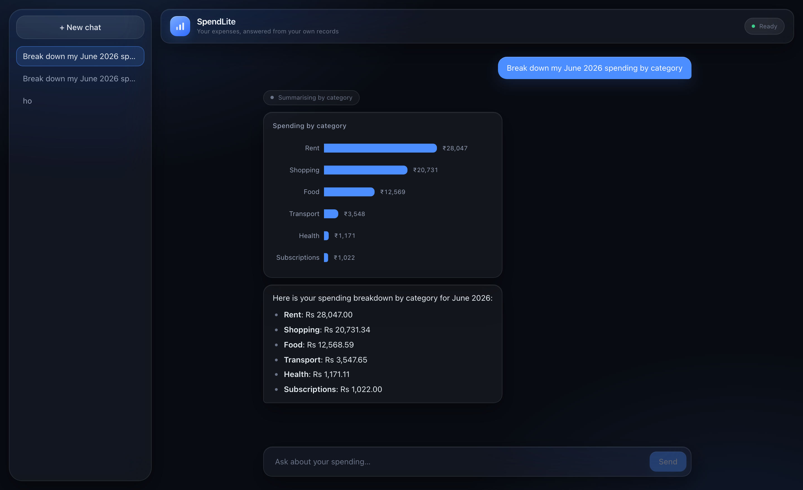
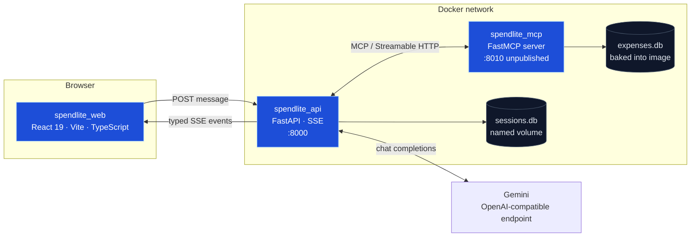
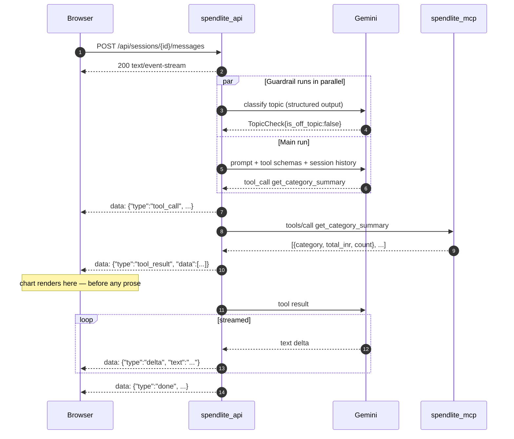
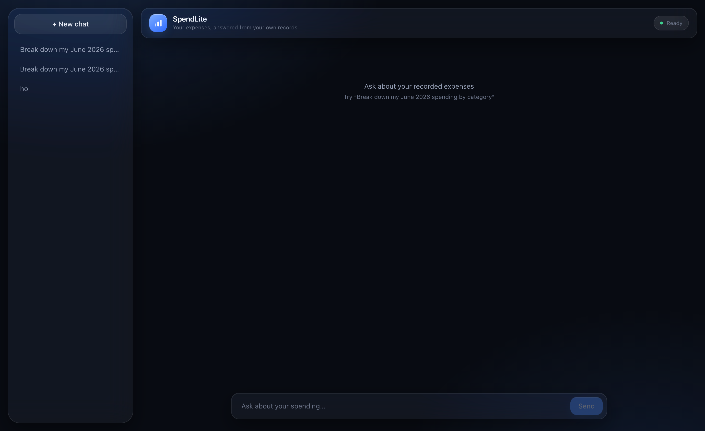

# SpendLite

A conversational expense assistant built to prove one idea: **an agent's tools can live in a different process from the model, connected only by a URL.**

Ask "how much did I spend on food in June?" and a Gemini-backed agent discovers remote tools over MCP, queries a SQLite database it has no direct access to, and streams the answer back token by token — with a chart rendered from the tool's structured output rather than from anything the model said.

Demo video: https://drive.google.com/file/d/19T3jsrhsI_uzKnATpFmg-Z-uRzrLEcBY/view?usp=sharing

Everything above is one turn. The pill reading *Summarising by category* is a live `tool_call` event; the chart below it is drawn from the `tool_result` payload — real numbers straight out of SQLite — and only then does the prose stream in.

---

## Why this exists

Most agent demos put the model, the tools, and the UI in one process, which hides the interesting parts. SpendLite deliberately splits into **three processes across three protocol boundaries**, each of which can be inspected raw with a standard tool:

| Boundary | Protocol | Inspect it with |
| --- | --- | --- |
| Agent ↔ tools | MCP over Streamable HTTP | `npx @modelcontextprotocol/inspector` |
| Browser ↔ agent | Server-Sent Events | `curl -N` |
| Browser ↔ API | HTTP + JSON | browser devtools |

If something breaks, exactly one boundary is at fault, and you can watch that boundary directly without the other two in the way. That property drove almost every decision below.

## Architecture



`spendlite_agent` is not a process — it's a library that `spendlite_api` imports. That separation is what let the same agent run in a terminal REPL first and behind HTTP later without changing a line.

### One turn, end to end



The chart renders off step 8, not off the model's words. That is the single most important design decision in the project — see [Deterministic charts](#3-charts-render-from-tool-results-not-from-the-model).

### The event protocol

`spendlite_api` never leaks the Agents SDK's internal event shapes to clients. It normalizes them into six types, defined once in `spendlite_api/events.py` and mirrored as a TypeScript discriminated union in `spendlite_web/src/lib/events.ts`:

| Event | Payload | Emitted when |
| --- | --- | --- |
| `delta` | `{text}` | each chunk of assistant text |
| `tool_call` | `{name, call_id}` | the agent invokes a tool |
| `tool_result` | `{name, call_id, data}` | a tool returns — **drives the chart** |
| `guardrail_triggered` | `{message}` | input guardrail tripwire fires |
| `done` | `{session_id}` | run completed |
| `error` | `{message}` | anything failed mid-run |

Two invariants clients rely on: every frame carries a `type`, and **every stream terminates in exactly one of** `done`**,** `guardrail_triggered`**, or** `error`. The frontend's "is it still thinking?" state depends on the second one. Unknown event types are ignored by design, so the protocol can grow without breaking older clients.

## Technical decisions

### 1. Gemini through the OpenAI SDK

The agent runs on the OpenAI Agents SDK but never talks to OpenAI. Google exposes a Chat Completions-compatible endpoint, so pointing `AsyncOpenAI` at a different `base_url` is the entire integration (`spendlite_agent/model.py`):

```python
client = AsyncOpenAI(api_key=..., base_url="https://generativelanguage.googleapis.com/v1beta/openai/")
return OpenAIChatCompletionsModel(model=..., openai_client=client)
```

`OpenAIChatCompletionsModel` specifically — not the SDK's default Responses API model — because Gemini's compatibility layer implements Chat Completions. Total API cost for the project: ₹0, on the free tier.

### 2. Tool errors are written for a reader who can act on them

MCP tools raise `ToolError` with messages designed as a self-correction path for the model, not as diagnostics for a human:

```
Unknown category 'nonsense'. Valid categories are: food, health, rent, shopping, subscriptions, transport.
Invalid month '2026-13'. Expected YYYY-MM between 01 and 12, for example 2026-06.
Call get_available_months to see which months have data.
```

Anything that isn't a `ToolError` gets masked into a generic error by FastMCP, which is correct — it stops internals leaking to clients — but it also turns a recoverable mistake into a dead end. Naming valid options in the error text is what turns a failure into a retry.

Structural constraints are enforced declaratively instead (`Field(ge=1, le=100)` on `limit`), so Pydantic rejects them before the function body runs.

### 3. Charts render from tool results, not from the model

When `get_category_summary` returns, the backend forwards its parsed rows as a `tool_result` event and the frontend renders a bar chart from that payload. The model is never asked to produce chart data.

The alternative — giving the agent a `show_chart(spec)` tool and letting it decide — is more "agentic" and demos worse: the chart appears at the model's discretion, and the model has to copy numbers it already has into a second structure, where it can corrupt them. Deterministic wiring means the chart appears **every time** the tool runs, with values that came straight from SQL.

This is also the pattern that generalizes: normalize the run into typed events, let the client decide how to present each one.

### 4. Session state lives in SQLite, not in the process

`SQLiteSession` holds conversation history, so the `Agent` object carries no per-conversation state and one instance is shared safely across all requests. Restarting the server, or reloading the browser, resumes exactly where you left off.

The session **list** needed no new table: the SDK's own `agent_sessions` table already tracks ids and timestamps, and a title is just the first user message, extracted with `json_extract` (`spendlite_api/sessions.py`). Fewer tables, no write path to keep in sync, and it worked retroactively on sessions created before the web UI existed.

#### Why sessions must move to Postgres in production

This project has two SQLite databases, and only one of them is a problem at scale. Separating them matters.

`expenses.db` is **read-only and baked into the image** at build time. Many readers, no writers, no volume, no coordination. SQLite is simply the right answer there, and would remain right at far larger sizes — it is the most widely deployed database in the world precisely for this shape of workload.

`sessions.db` is **written on every turn**, and that changes everything:

- **One instance, permanently.** SQLite has a single-writer model. Two API replicas pointed at the same file will corrupt it — so horizontal scaling is off the table, and so are rolling deploys, where the old and new containers briefly overlap.
- **The disk has to survive.** History lives on a mounted volume. Any platform with an ephemeral filesystem — most serverless products and most free tiers — silently loses every conversation on restart.
- **Writes serialize.** Concurrent users queue behind one another's turns. Invisible at demo scale; a real ceiling past a handful of people.
- **No point-in-time recovery.** Backup means copying a file while nothing is writing to it.

None of this matters for a laptop demo, which is what this is. All of it matters the moment there is more than one user or more than one instance — and it is the reason the deployment guidance says *exactly one replica, on a persistent volume*.

The migration is smaller than it looks. The Agents SDK defines a `Session` protocol (`agents.memory.SessionABC`) with exactly four methods — `get_items`, `add_items`, `pop_item`, `clear_session` — so a Postgres-backed session is one class implementing those four, swapped in behind `open_session()` in `spendlite_api/sessions.py`. The SDK's other built-in, `OpenAIConversationsSession`, stores history on OpenAI's servers and is not an option here, since this project runs on Gemini.

Two things travel with that change: the session-list query uses SQLite's `json_extract`, which becomes `->>` on Postgres, and the `SPENDLITE_SESSIONS_DB` file path becomes a connection URL. In exchange, the single-instance constraint disappears entirely.

### 5. SSE over WebSockets, and POST over `EventSource`

The stream is one-directional, so SSE is sufficient and — unlike a WebSocket frame — inspectable with `curl`. The browser's native `EventSource` API only issues GET requests, which would force the user's message into a query string, so the frontend POSTs and parses the SSE frames by hand from a `ReadableStream` (`spendlite_web/src/lib/stream.ts`).

Hand-parsing means handling the case a library would hide: **a network chunk can end mid-frame**. The reader keeps the trailing partial in a buffer and parses only complete `\n\n`-terminated frames.

### 6. The MCP service publishes no host port

In `docker compose`, `spendlite-mcp` is reachable only from inside the network, addressed by service name (`http://spendlite-mcp:8010/mcp`). An MCP server is an unauthenticated tool API — the fewer places it is reachable from, the better. Publishing the port is a one-line change, used only when attaching MCP Inspector for a demo.

## Findings

Three problems found by measurement rather than reading docs. Each shaped the code.

### Gemini merges parallel tool calls

When the model emits two tool calls in one turn, Gemini's OpenAI-compatibility layer streams both argument objects into a **single** call:

```
CALL 'get_category_summary' args='{"message":"Checking spending..."}{"month":"2026-06"}'
                                  └── first call's args ──────────┘└─ second call's ─┘
```

The concatenated JSON is unparseable, and the malformed call then poisons the next request with a `400 INVALID_ARGUMENT`.

Measured: **3/4 runs succeeded** with a local `report_progress` tool wired alongside the MCP tools, **5/5** without it. `ModelSettings(parallel_tool_calls=False)` had no effect — the compatibility layer ignores it. The fix was to unwire the local tool so the agent emits one call per turn; the browser's `tool_call` events already provided better progress feedback than the tool did. The function remains in `core.py`, unwired and commented, as evidence.

This is a workaround, not a cure — two MCP tools in one turn could still trigger it. That's precisely why the protocol has an `error` event: the failure surfaces visibly instead of hanging.

### A tripped guardrail poisoned the whole conversation

The Agents SDK writes the user's message to the session *before* guardrails resolve, so a tripped message stayed in history:

```
user      Should I invest in stocks?   ← tripped, but stored
user      and transport?               ← tripped too, as collateral damage
```

Both the main agent and the guardrail agent read session history, so one off-topic question made every later question look off-topic — the agent started answering "I cannot give investment advice" to a question about transport. Verified in isolation that the guardrail classifies the bare string "and transport?" as *on* topic; the contaminated history was overriding it.

Fixed with one line — `await session.pop_item()` in the tripwire handler — which removes the message so it can't affect later turns.

### The free-tier quota is per day, per model

`gemini-2.5-flash` allows **20 requests per day** on the free tier, not per minute. At three to four calls per turn (guardrail, tool decision, tool round trip), that is roughly five conversations. Quota is tracked *per model*, so `SPENDLITE_MODEL` is an environment variable and switching to `gemini-flash-lite-latest` provided a fresh bucket.

## Repository layout

```
spend-mon/
├── docker-compose.yml
├── .env.example
├── spendlite_mcp/           # FastMCP server — owns the data, no LLM
│   ├── seed.py              #   generates ~190 rows, Mar–Jun 2026, deterministic
│   ├── db.py                #   the only file that writes SQL
│   ├── schemas.py           #   Pydantic models = published tool schemas
│   └── server.py            #   4 read-only tools
├── spendlite_agent/         # agent library — imported, never run as a service
│   ├── model.py             #   Gemini via OpenAI-compatible endpoint
│   ├── core.py              #   agent + MCP connection factories
│   ├── guardrail.py         #   structured-output topic classifier
│   ├── instructions.txt     #   grounding rules and refusals
│   └── chat.py              #   terminal REPL (kept as a debugging gate)
├── spendlite_api/           # FastAPI — imports spendlite_agent
│   ├── events.py            #   the six-event protocol
│   ├── sessions.py          #   session list + history
│   └── main.py              #   lifespan, SSE translator, static mount
└── spendlite_web/           # React SPA
    └── src/
        ├── lib/             #   events.ts · stream.ts · chat.ts · api.ts
        └── components/      #   chat UI + Recharts category chart
```

`spendlite_agent` and `spendlite_api` are packages imported from the repo root; `spendlite_mcp` uses flat imports because it ships as a standalone container.

## Running it

Requires Docker, a [Gemini API key](https://aistudio.google.com/apikey) (free), and for local development Python 3.12 and Node 20+.

### Containers

```bash
cp .env.example .env      # add your GEMINI_API_KEY
docker compose up --build
```

Open **http://localhost:8000** — FastAPI serves the compiled SPA, so there is no separate frontend server.

Past conversations are listed on the left and survive restarts, because history lives in SQLite rather than in the server process.

### Local development

```bash
uv venv --python 3.12 && source .venv/bin/activate
uv pip install -r spendlite_mcp/requirements.txt \
               -r spendlite_agent/requirements.txt \
               -r spendlite_api/requirements.txt
python spendlite_mcp/seed.py
```

Three terminals:

```bash
python spendlite_mcp/server.py                      # tools       :8010
uvicorn spendlite_api.main:app --port 8000 --reload  # agent + API :8000
cd spendlite_web && npm install && npm run dev       # UI          :5173
```

Vite proxies `/api` to port 8000, so the app is same-origin in development and in the container — no CORS configuration anywhere.

A terminal client is also available and useful for isolating agent problems from web problems:

```bash
python -m spendlite_agent.chat          # --new starts a fresh session
```

### Configuration

| Variable | Default | Used by |
| --- | --- | --- |
| `GEMINI_API_KEY` | — | agent, guardrail |
| `SPENDLITE_MODEL` | `gemini-flash-lite-latest` | agent, guardrail |
| `SPENDLITE_MCP_URL` | `http://localhost:8010/mcp` | api |
| `SPENDLITE_DB_PATH` | `./expenses.db` | mcp |
| `SPENDLITE_SESSIONS_DB` | `./sessions.db` | api, terminal chat |

The MCP path has **no trailing slash** — FastMCP 3.x serves `/mcp` and 307-redirects `/mcp/`, and POST-with-body redirects are a poor thing to depend on.

## Verifying each layer

The layers were built in this order, and each one has a check that does not involve the layer above it.

**Tools, without a model.** Point MCP Inspector at `http://localhost:8010/mcp`. All four tools should list with correct schemas; `get_category_summary(month="2026-06")` returns data; `month="2026-13"` returns a readable validation error rather than a traceback. Cross-check any number against SQL directly:

```bash
sqlite3 expenses.db "SELECT ROUND(SUM(amount_inr),2) FROM expenses
                     WHERE category='food' AND substr(spent_on,1,7)='2026-06';"
```

**The agent, without a browser.** Run `python -m spendlite_agent.chat` and confirm it reports that exact number, calls `get_available_months` rather than guessing when asked for "the latest month", remembers the month across a follow-up, and refuses to add an expense.

**The protocol, without a UI.**

```bash
curl -N -X POST localhost:8000/api/sessions/test/messages \
  -H 'content-type: application/json' \
  -d '{"message":"Break down my June 2026 spending by category"}'
```

Frames should arrive progressively, `tool_result.data` should be a parsed array rather than a string, and the stream should end in exactly one terminal event.

## Tools

| Tool | Arguments | Returns |
| --- | --- | --- |
| `get_available_months` | — | `[{month, expense_count}]` |
| `list_categories` | — | categories present in the data |
| `get_expenses` | `month`, `category?`, `limit?` (≤100) | expense rows, newest first |
| `get_category_summary` | `month` | `[{category, total_inr, count}]` |

All read-only. There is no write tool, so "add an expense" is refused twice over: by the instructions, and by the absence of any mechanism.

## Stack

Grouped by the process each piece runs in.

**Tools —** `spendlite_mcp`


**Agent & API —** `spendlite_agent` · `spendlite_api`


**Web —** `spendlite_web`


**Deploy**


## What I would do next

- **Postgres for the session store.** The single-writer constraint is what pins this to one instance — see [Why sessions must move to Postgres in production](#why-sessions-must-move-to-postgres-in-production). `expenses.db` can stay SQLite indefinitely; it is read-only and baked into the image.
- **If the expense data ever moves too,** the queries port with small mechanical changes rather than unchanged: `substr()` and the `GROUP BY` / `ORDER BY` aliases are portable, but `ROUND(SUM(x), 2)` has no `double precision` overload on Postgres, and every `?` placeholder becomes `%s`.
- **Auth and multi-user sessions.** Session ids are currently unguessable but unauthenticated — fine for a laptop demo, not for a shared deployment.
- **Retry the merged-tool-call failure** rather than surfacing it. The `error` event makes it visible; it could be made recoverable.
- **Replay fixtures for the frontend.** Recorded event streams would let UI work continue without spending API quota.
- **Persist tool activity alongside messages.** Charts are built from live `tool_result` events, which are not stored in session history — so reloading a past conversation shows its text but not its chart.

## A note on prompt instructions as a control surface

`instructions.txt` governs refusals, grounding, rupee formatting, *and* presentation — rule 7 asks for markdown tables, rule 9 asks the model not to restate a breakdown the chart already shows. That last rule is only partly obeyed: `gemini-flash-lite-latest` still lists every category under the chart, as the screenshot above shows.

That is the honest lesson. A prompt is advisory, and a smaller model honours negative constraints ("do not list…") less reliably than positive ones. Anything that genuinely must hold belongs in code — which is why rupee formatting in the chart is done by `Intl.NumberFormat` rather than requested from the model, and why the chart is wired to tool output instead of trusted to the model's discretion.

## How this was learned and built

This is my first agent, so it seems worth being specific about where the knowledge and the code came from.

### What I learned from

- **James Briggs — [Agents SDK from OpenAI | Full Tutorial](https://www.youtube.com/watch?v=35nxORG1mtg)** — the agent loop, `Agent` and `Runner`, function tools, guardrails, and conversational agents. Most of the agent-side vocabulary in this repo comes from here.
- [**Model Context Protocol Explained in 20 Minutes**](https://www.youtube.com/watch?v=N3vHJcHBS-w) — a primer watched before the course, which is what made the process split in this project feel like the obvious design rather than an exotic one.
- few articles: https://developers.openai.com/api/docs
- Gemini for reasoning and learning basic concepts

### Where AI was used

The implementation plan was produced with Claude, using an interview format (`.agents/skills/grill-me`) in which the model interrogates a proposal rather than agreeing with it — pushing on scope, on whether the terminal client should survive, on how chart data should reach the browser. **I made the architecture decisions**; the value of the exercise was being forced to defend them. The resulting phase plans live in `docs/`.

From there:

- **The MCP server and the agent I implemented myself**, which is where the learning is concentrated — tool schemas, `ToolError` messages designed for a model to recover from, the Gemini wiring, the guardrail, session memory with **assisted AI** to get familair with patterns
- **The web layer I handed to Claude** — the SSE translator, the React chat UI, and the styling — working from the event protocol I had already specified.

The three entries under [Findings](#findings) came out of that collaboration: each was a real failure observed while running the thing, then reduced to a measurement before being fixed. Those measurements, and the decision of what to do about each, are mine.
