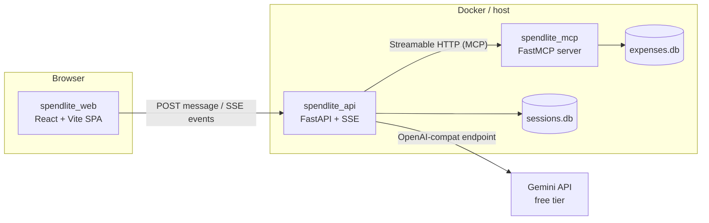

# Spend-Mon Lite — Implementation Overview

**Supersedes:** scope sections of `spend-mon-prd.md` v1.0 (the component specs there remain the source of truth for tool/schema details).
**Decided:** 2026-07-25, via design interview. **Owner:** Abhi.

---

## 1. What changed from the PRD

The PRD split the build into Milestone 0 (terminal, one evening) and Milestone 1 (web UI). We merged them into **one continuous, phased build** with hard gates between phases. The terminal chat survives — not as a deliverable, but as a **debugging gate**: when the web layer misbehaves, you already know the agent underneath it works.

The final system:



Three process boundaries, each crossed by one protocol you can inspect raw: MCP (Inspector), SSE (curl), HTTP JSON (browser devtools). That inspectability is the point of the whole design.

## 2. Decisions log (from the grilling session)

| # | Decision | Choice | Why |
|---|----------|--------|-----|
| 1 | Scope | Merge terminal + web + hosting into one phased build | Learning-first, no deadline; milestones were an artifact of the one-evening constraint |
| 2 | Terminal chat | Survives as **Phase 2 gate** | Layered debugging: Inspector proves tools, terminal proves agent, so web bugs can only be web bugs |
| 3 | UI | Full web chat app (React) | Abhi is comfortable with React; the SSE plumbing is the Con-Mon-relevant skill |
| 4 | UI features | Streaming + tool chips, markdown + tables, session sidebar, charts — **in that build order** | Sidebar before charts: session management is core agent learning, charts are polish |
| 5 | Chart wiring | **Typed SSE events** — backend forwards tool results; frontend renders charts deterministically | It *is* the Con-Mon normalized-event pattern; demo-safe (chart appears every time). Agent-driven `show_chart` deferred as a stretch experiment |
| 6 | Transport | SSE over WebSockets | One-directional streaming fits; PRD roadmap names SSE; simpler to inspect with curl |
| 7 | Frontend stack | Vite + React + TypeScript SPA (no Next.js) | No SSR need for a laptop demo; TS types mirror the event protocol — typed events on both ends |
| 8 | Hosting | Laptop via docker compose; EC2 as optional stretch | Demo audience is a senior engineer with Abhi present; no public URL → no auth/abuse surface |
| 9 | Docs style | Spec + shape; **Abhi writes the code** | First agent build; what you type is what you learn |
| 10 | Budget | ₹0 (Gemini free tier) — unchanged | Guardrail doubles model calls per turn; watch free-tier RPM (see Phase 2 pitfalls) |

## 3. Repository layout (final)

```text
spend-mon/
├── docker-compose.yml
├── .env.example
├── README.md
├── docs/                       # these implementation plans
├── spendlite_mcp/              # Phase 1 — FastMCP server (containerized)
│   ├── Dockerfile
│   ├── requirements.txt
│   ├── server.py  schemas.py  db.py  seed.py
├── spendlite_agent/            # Phase 2 — agent core + terminal chat
│   ├── requirements.txt
│   ├── core.py                 # agent factory (shared with the API — key refactor)
│   ├── model.py  guardrail.py  chat.py  instructions.txt
├── spendlite_api/              # Phase 3 — FastAPI + SSE, imports spendlite_agent.core
│   ├── Dockerfile              # multi-stage: builds web, serves everything
│   ├── requirements.txt
│   ├── main.py  events.py  sessions.py
└── spendlite_web/              # Phase 4 — Vite + React + TS
    ├── package.json  vite.config.ts
    └── src/ ...
```

Run all Python from the repo root (`python -m spendlite_api.main`) so `spendlite_api` can import `spendlite_agent` without packaging ceremony.

## 4. Phase map

| Phase | Doc | Builds | Gate (hard stop — do not proceed until it passes) | Honest hours |
|-------|-----|--------|---------------------------------------------------|--------------|
| 1 | `01-mcp-server.md` | Seeded SQLite + 4 MCP tools over Streamable HTTP | MCP Inspector lists tools; bad month → structured error, not traceback | 3–4 |
| 2 | `02-terminal-agent.md` | Gemini-wired agent, streaming terminal chat, memory, guardrail | All 7 PRD acceptance behaviors pass in the terminal | 4–5 |
| 3 | `03-web-backend.md` | FastAPI, normalized SSE event protocol, session CRUD | `curl -N` shows typed SSE frames incl. `tool_result`; sessions listable | 4–6 |
| 4 | `04-web-frontend.md` | React chat: streaming → markdown → sidebar → charts | Full browser UX checklist | 8–12 |
| 5 | `05-deploy-demo.md` | docker compose (2 services), demo script, EC2 stretch | `docker compose up` → working browser demo; ≤5-min script rehearsed | 3–4 |

Total: roughly **25–30 hours** at a learning pace. The PRD's "one evening" applies to Phases 1–2 only, and only on a good evening.

## 5. Working agreements

1. **Gates are hard stops.** Never debug two layers at once; that is the entire reason the phases exist.
2. **Docs give spec + shape, not code.** Snippets in these docs show the *shape* of an API (like the PRD's §5.3); you write the real thing. If you catch yourself pasting, stop and type.
3. **Every tool docstring is a prompt.** You are writing for the model, not for pydoc — one sentence on what, one on when.
4. **Config via environment from day one.** Anything that differs between host/container/EC2 is an env var, never a constant.

## 6. Configuration (`.env.example`, final superset)

```env
GEMINI_API_KEY=your_key_here
SPENDLITE_MODEL=gemini-2.5-flash
SPENDLITE_MCP_URL=http://localhost:8010/mcp/
SPENDLITE_DB_PATH=./expenses.db          # MCP server
SPENDLITE_SESSIONS_DB=./sessions.db      # agent + API
SPENDLITE_API_PORT=8000
```
